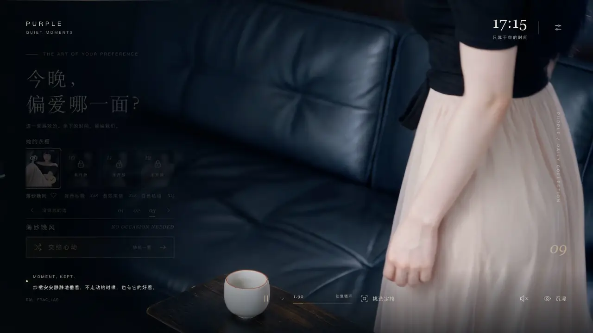

# PURPLE · 片刻

> 一张会陪你换装的桌面互动壁纸 —— macOS 版。

> [!NOTE]
> **原作**由 B 站 UP 主 **[FRAC_LAB](https://space.bilibili.com/7570868)** 开发。
> 本仓库是在原作基础上的**二次开发**，做了 Mac 版本；仓库作者**不是** FRAC_LAB 本人。
> 喜欢的话请去原作者主页支持：<https://space.bilibili.com/7570868>

<p align="center"></p>

**本仓库只提供 macOS 版**（macOS 12 及以上），借助免费的 [Plash](https://sindresorhus.com/plash) 设为 Mac 的动态桌面。
Windows 用户请直接在 Wallpaper Engine（小红车）创意工坊搜索 **FRAC_LAB** 安装原作。

## 有什么

- 九套穿搭，可以点选、随机挑，或每隔一段时间自动换一套
- 默认来回往复播放，也可以定格在喜欢的那一秒
- 入场时有声音，之后安静陪着；窗口挡住桌面时自动静音
- 4K60 画质，开机自动运行
- **除了 Plash 什么都不用装**，不需要 Python、Xcode 或命令行工具

## 安装

**交给 AI 编程助手（推荐）** —— 把这句话发给 Claude Code、Cursor 等：

```
请按 https://github.com/opop32165455/mac-desktop-hinata 里 AGENTS.md 的部署步骤，把这个桌面壁纸部署到我的 Mac 上。安装位置先问我。
```

**或者自己动手：**

1. 在 App Store 安装 [Plash](https://apps.apple.com/app/plash/id1494023538)。
2. 下载本项目（Code → Download ZIP），解压到一个固定的文件夹，例如 `~/PurpleWallpaper`。
   不要放在「桌面」「文稿」「下载」或 iCloud 里。
3. 双击文件夹里的 **`plash-start.command`**。
   若提示「无法验证开发者」，到「系统设置 → 隐私与安全性」点「仍要打开」。
4. 在 Plash 设置 → Advanced 里关掉静音，才能听到声音。

## 小提示

- **换装、改设置**：点菜单栏的 Plash 图标，开启浏览模式（Browsing Mode）。
- **快速回到桌面**：浏览模式下点桌面不会回到桌面，建议在「系统设置 → 桌面与程序坞 → 触发角」设一个「桌面」。
- **文件夹不要移动**；移动了或壁纸打不开，重新双击 `plash-start.command` 即可。
- **卸载**：双击 `plash-stop.command`，再在 Plash 里删除这个网站。

## 声明与致谢

原作由 B 站 UP 主 [FRAC_LAB](https://space.bilibili.com/7570868) 开发，版权归原作者所有。本仓库是基于原作的 Mac 版二次开发，作者与 FRAC_LAB 无关联。AI 生成，所有角色均为虚构。
